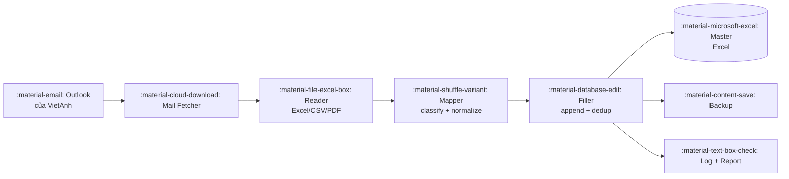

# Vấn đề & giải pháp

## :material-alert-circle-outline: Vấn đề thực tế

Mỗi ngày phòng kinh doanh có 5-10 sale phụ trách các nhóm sản phẩm bảo hiểm khác nhau.
Mỗi sale gửi mail báo các phiếu cấp đơn mới — kèm file Excel/CSV theo mẫu riêng của họ.

Người làm thao tác viên ngồi cuối quy trình phải:

1. Mở từng mail.
2. Tải attachment.
3. Mở file tổng `Danh sách cấp đơn Offline PTI.xlsx` (20 sheet).
4. Tìm đúng sheet theo loại sản phẩm.
5. Copy-paste từng dòng, đánh STT, format ngày, format tiền.
6. Check trùng lặp tay (CCCD đã có chưa, biển số có rồi không).
7. Lưu, backup, gửi confirm lại cho sale.

!!! danger "Pain points"
    - **Tốn thời gian:** trung bình 1.5 giờ / ngày, đỉnh điểm 3 giờ.
    - **Sai sót cao:** copy nhầm cột, ngày sai format (mm/dd vs dd/mm), thiếu dấu CCCD.
    - **Không trace được:** ai gửi cái gì, lúc nào, có sót không.
    - **Không scale:** thêm sale → thêm tay.

## :material-check-circle-outline: Giải pháp

Pipeline Python chạy local trên máy Windows, đọc trực tiếp Outlook desktop qua COM.

### Triết lý thiết kế

| Nguyên tắc | Thực thi |
|-----------|----------|
| **An toàn data > tốc độ** | Append-only, backup trước mỗi run, lock file, dedup. |
| **Idempotent** | Chạy 2 lần cùng 1 mail không bao giờ ghi đôi. |
| **Trace được** | Mỗi dòng mới đều log `source_email_id` + `source_attachment`. |
| **Mỗi sale 1 quirk** | Reader dùng fuzzy match header + alias.yaml để handle tên cột khác nhau. |
| **Mở rộng dần** | Phase 1 MVP 1 sản phẩm → Phase 2 đủ 6 → Phase 3 DB → Phase 4 service/GUI. |
| **Auto + transparent** | Claude Code tự code theo TODO.md, mỗi task xong push GitHub để user review. |

## :material-account-group-outline: Đối tượng dùng

- :material-account-tie: **VietAnh (thao tác viên)** — chạy pipeline mỗi sáng, review report.
- :material-account-multiple: **Sale (gián tiếp)** — không cần biết tool tồn tại, vẫn gửi mail như cũ.
- :material-shield-account: **Quản lý** — xem dashboard / report cuối ngày, audit theo log.

## :material-target: Phạm vi (MVP vs tương lai)

=== "MVP (Phase 1)"

    - :material-check: Đọc Outlook local (1 profile).
    - :material-check: Hỗ trợ 1 sản phẩm: Du lịch.
    - :material-check: Đọc Excel/CSV.
    - :material-check: Ghi thẳng file Excel tổng.
    - :material-check: Backup + log.

=== "Phase 2"

    - :material-check: Mở rộng 6 sản phẩm chính.
    - :material-check: Đọc PDF (pdfplumber + OCR fallback).
    - :material-check: Scheduler chạy mỗi 15'.
    - :material-check: Report email cuối ngày.

=== "Phase 3"

    - :material-check: Database SQLite local.
    - :material-check: Excel thành export view.
    - :material-check: CLI query / export.

=== "Phase 4"

    - :material-check: Windows service.
    - :material-check: GUI cho non-tech user.
    - :material-check: API FastAPI cho remote query.

=== "Phase 5"

    - :material-check: Trang web docs này (bạn đang xem).
    - :material-check: Auto-deploy GitHub Pages.
