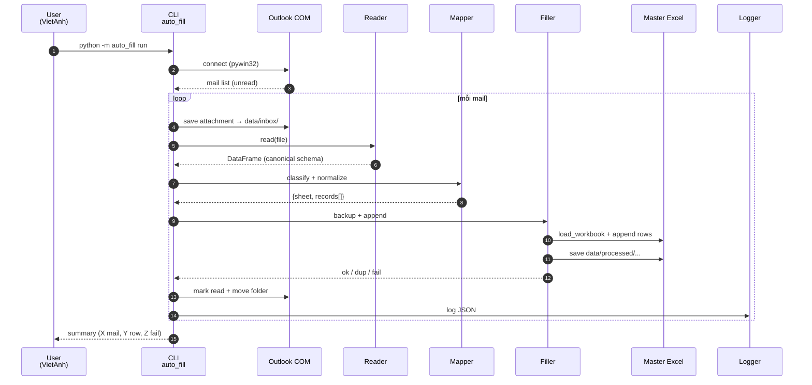
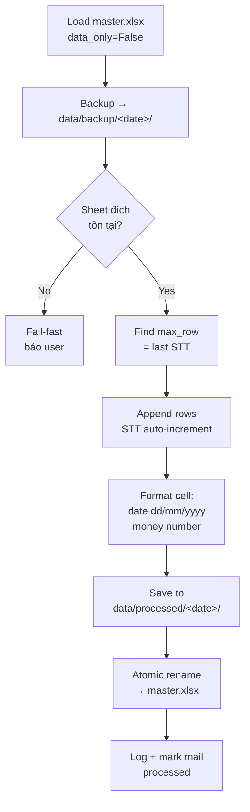
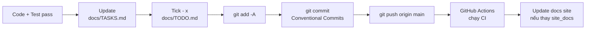

# Cách hoạt động

## :material-sitemap-outline: Pipeline tổng thể



## :material-layers-outline: 7 tầng xử lý

### :one: Mail Fetcher

- Kết nối Outlook đang chạy trên máy qua **pywin32 COM**.
- Lọc mail theo:
    - Sender ∈ allowlist (cấu hình `.env`)
    - Subject match regex (`(?i)cấp đơn|phiếu cấp`)
    - `Unread = True`
- Trả về iterator `MailMessage`.

!!! tip "Tại sao COM thay vì IMAP/Graph?"
    Outlook desktop có thể đọc PST local, không cần token Azure. COM gọi thẳng Outlook đang chạy → 0-config. Trade-off: chỉ chạy được trên Windows + Outlook phải mở. Xem [ADR-001](https://github.com/VietAnh954/Project_Autofill_capDon/blob/main/docs/DECISIONS.md#adr-001).

### :two: Attachment Downloader

- Save vào `data/inbox/<msg_id>_<filename>`.
- Skip file > `MAX_ATTACHMENT_MB` (default 20MB).
- Chỉ chấp nhận extension: `.xlsx`, `.xls`, `.csv`, `.pdf` (Phase 2).

### :three: Reader

- Detect file type bằng extension + magic bytes.
- **Excel/CSV** (`openpyxl` + `pandas`):
    - Auto-detect header row (row 1, 2, hoặc 3 tuỳ template sale).
    - Rename cột → **canonical schema** nội bộ (English snake_case).
- **PDF** (Phase 2, `pdfplumber`):
    - Extract table.
    - Nếu là PDF scan → OCR `pytesseract`.

### :four: Classifier

Quyết định sheet đích theo PRIORITY:

| Priority | Cách | Ví dụ |
|----------|------|-------|
| 1 | Sender hint (config `.env`) | `daily.dulich@…` → Du lịch |
| 2 | Subject keyword | "phiếu xe máy" → Thông tin cấp Bảo hiểm xe máy |
| 3 | Column signature | có `Biển số` + `Số chỗ ngồi` → Bao hiem oto |
| 4 | Fallback | `data/failed/unclassified/` + log |

### :five: Normalizer

| Field | Rule |
|-------|------|
| Ngày | `dd/mm/yyyy`, `yyyy-mm-dd`, Excel serial → `datetime.date` |
| CCCD/CMND | UPPERCASE, strip space, validate length |
| Số điện thoại | `+84xxx` → `0xxx`, strip dấu cách |
| Tiền | `"1,500,000 VND"` → `1500000.0` (VND, float) |
| Họ tên | Collapse whitespace, giữ nguyên case |
| Biển số | UPPERCASE, giữ `-` `.` |

### :six: Validator + Dedup

- **Validator:** check required field theo từng sheet (xem [DATABASE.md](https://github.com/VietAnh954/Project_Autofill_capDon/blob/main/docs/DATABASE.md)).
- **Dedup keys** (mỗi sheet 1 set):

```
Du lịch:    (CCCD, Ngày đi, Nơi đến)
Sức khỏe:   (CCCD, Ngày hiệu lực)
Ô tô:       (Biển số, Ngày cấp đơn)
Xe máy:     (Biển số xe, Ngày cấp đơn)
BHYT/BHXH:  (CCCD NĐBH, Loại BH, Năm hiệu lực)
HSSV:       (CCCD, Năm học)
```

Trùng → đẩy `data/failed/duplicates/`, KHÔNG ghi.

### :seven: Filler



## :material-shield-check-outline: Đảm bảo an toàn

| Cơ chế | Mô tả |
|--------|-------|
| **Append-only** | KHÔNG bao giờ sửa / xoá dòng cũ. |
| **Backup mỗi run** | Snapshot vào `data/backup/<date>/` trước khi ghi. |
| **Lock file** | `.lock` cạnh master, tránh 2 process ghi đè. |
| **Atomic rename** | Save sang temp → rename, nếu crash → master gốc nguyên. |
| **Idempotent** | Cùng mail chạy 2 lần → không double-write (dedup + mark read). |
| **Audit log** | JSON line / mail, có `source_email_id`, `source_attachment`. |
| **Validate trước ghi** | Sai → đẩy `failed/`, KHÔNG chạm master. |

## :material-source-branch-sync: Auto commit + push lên GitHub

Mỗi task trong `docs/TODO.md` xong:



User chỉ cần mở github.com xem mỗi commit là 1 task hoàn chỉnh.
