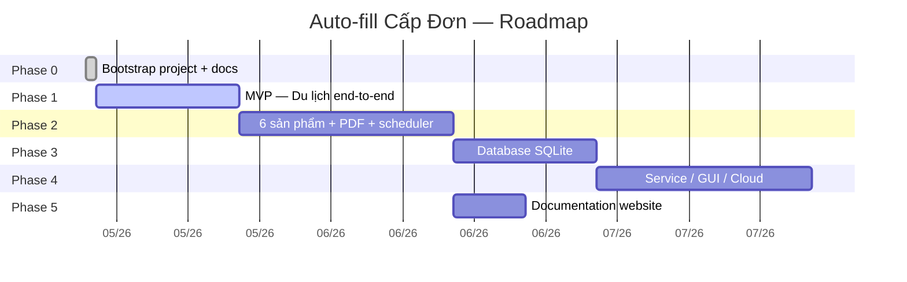

# Roadmap

## Trạng thái hiện tại

| Phase | Mô tả | Status |
|------:|-------|--------|
| 0 | Bootstrap repo + docs + Claude auto-loop config | :material-check-bold: Done |
| 1 | MVP — Du lịch end-to-end (Outlook → Excel) | :material-progress-clock: In Progress |
| 2 | Mở rộng 6 sản phẩm + PDF reader + scheduler + report | :material-clock-outline: Pending |
| 3 | SQLite database + migration tool | :material-clock-outline: Pending |
| 4 | Windows service + GUI + API | :material-clock-outline: Pending |
| 5 | Documentation website (bạn đang đọc) | :material-progress-clock: In Progress |

## Tags / Releases

| Tag | Mô tả | Trigger |
|-----|-------|---------|
| `v0.0.1-bootstrap` | Hết Phase 0 | Auto khi tick xong task 0.8 |
| `v0.1.0-mvp-dulich` | Hết Phase 1 | Auto khi tick xong task 1.17 |
| `v0.2.0-multi-product` | Hết Phase 2 | Auto khi tick xong task 2.9 |
| `v0.3.0-database` | Hết Phase 3 | Auto khi tick xong task 3.6 |
| `v0.4.0-service` | Hết Phase 4 | Auto khi tick xong task 4.4 |
| `v0.5.0-docs-site` | Hết Phase 5 (web live) | Auto khi tick xong task 5.8 |
| `v1.0.0` | Production ready | Manual khi user OK |

Live tags: https://github.com/VietAnh954/Project_Autofill_capDon/tags

## Backlog (chưa ưu tiên)

- Hỗ trợ Gmail / Microsoft Graph
- Multi-tenant cho nhiều phòng
- Web dashboard realtime
- Mobile notification
