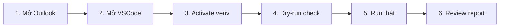

# Sử dụng hằng ngày

## :material-calendar-clock: Quy trình buổi sáng (3 phút)



### Chi tiết

=== "1. Mở Outlook"

    - Đảm bảo Outlook đang chạy.
    - Đảm bảo Inbox đã sync mail mới nhất.

=== "2. Mở VSCode"

    ```powershell
    cd C:\Users\ADMIN\OneDrive\Company\Project_Autofill_capDon
    code .
    ```

=== "3. Activate venv"

    Trong terminal VSCode:
    ```powershell
    .venv\Scripts\Activate.ps1
    ```

=== "4. Dry-run check"

    Đọc & parse, KHÔNG ghi vào master:
    ```powershell
    python -m auto_fill run --dry-run
    ```

    Output cho biết:
    - Bao nhiêu mail match filter.
    - Bao nhiêu record sẽ được ghi vào sheet nào.
    - Có record nào fail validate / dup không.

=== "5. Run thật"

    ```powershell
    python -m auto_fill run
    ```

    Pipeline sẽ:
    - Backup master vào `data\backup\<date>\`.
    - Append rows mới.
    - Move mail sang folder `Inbox\Processed\<date>`.
    - Log ra `logs\app.jsonl`.

=== "6. Review report"

    Mở file `data\reports\report_YYYY-MM-DD.md` (Phase 2).

    Hoặc xem nhanh log:
    ```powershell
    Get-Content logs\app.jsonl -Tail 50 | ConvertFrom-Json | Format-Table
    ```

## :material-robot-outline: Dùng Claude Code để code tiếp / sửa lỗi

Project được thiết kế để Claude tự code các Phase tiếp theo.

### Khởi động auto-mode

1. Mở chat Claude trong VSCode (icon Claude bên thanh activity).
2. Gõ:
   ```
   go
   ```
3. Claude đọc `CLAUDE.md` + `docs/TODO.md` + `docs/TASKS.md` → lấy task `- [ ]` đầu tiên → code → test → commit → push GitHub → lặp.

### Slash commands

| Lệnh | Tác dụng |
|------|----------|
| `/next` hoặc `go` | Tiếp tục auto-loop |
| `/status` | Xem phase hiện tại, % xong, task kế |
| `/verify` | Chạy pytest + ruff + mypy |
| `stop` | Dừng (làm xong task hiện tại) |
| `pause` | Tạm dừng ngay |

### Khi nào Claude dừng và hỏi

- Cần email cụ thể của sale chưa có trong allowlist.
- Cần xem 1 file mẫu để build alias cho cột mới.
- Test fail 2 lần liên tiếp.
- `git push` fail (auth / conflict).

Khi đó Claude in summary + câu hỏi cụ thể → bạn trả lời → gõ `go` để tiếp.

## :material-content-save-cog-outline: Backup & rollback

### Backup tự động

Mỗi lần `auto_fill run` chạy thật → snapshot vào:
```
data\backup\YYYY-MM-DD\master_HH-MM-SS.xlsx
```

Mặc định giữ 30 ngày.

### Rollback khi sai

```powershell
python -m auto_fill rollback --to data\backup\2026-05-14\master_09-30-00.xlsx
```

Hoặc copy tay file backup đè lên `data\master\master.xlsx`.

## :material-file-find-outline: Khi 1 phiếu bị skip

Pipeline đẩy file fail vào 1 trong 4 folder:

| Folder | Lý do |
|--------|-------|
| `data\failed\unclassified\` | Không xác định được sheet đích |
| `data\failed\invalid\` | Validate fail (thiếu field, sai format) |
| `data\failed\duplicates\` | Đã có trong master (CCCD/Biển số trùng) |
| `data\failed\unknown_schema\` | Header file lạ, chưa có alias |

Xem log để biết lý do cụ thể:
```powershell
Get-Content logs\app.jsonl -Tail 100 | Select-String "ERROR|WARNING"
```

## :material-clock-fast: Scheduled run (Phase 2)

Khi Phase 2 xong, có scheduler chạy mỗi 15':

```powershell
python -m auto_fill schedule --interval 15
```

Hoặc đặt Windows Task Scheduler chạy `python -m auto_fill run` mỗi giờ.

## :material-help-circle-outline: Cần giúp?

- :material-bookmark-check: [Khắc phục sự cố](troubleshoot.md)
- :material-source-repository: [Issue trên GitHub](https://github.com/VietAnh954/Project_Autofill_capDon/issues)
